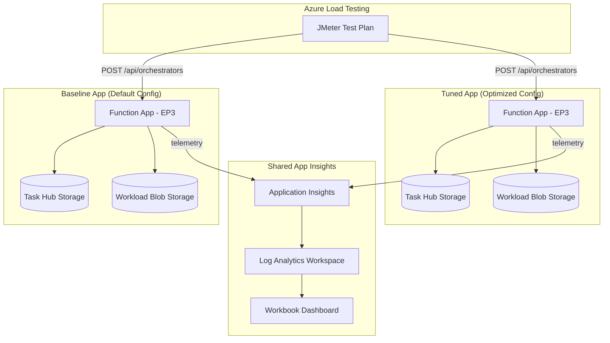
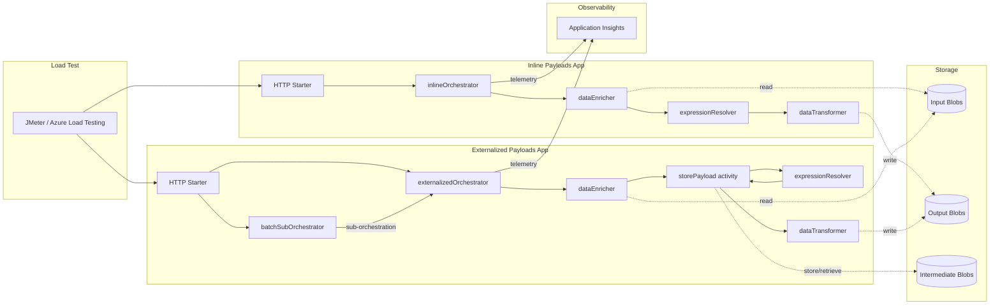
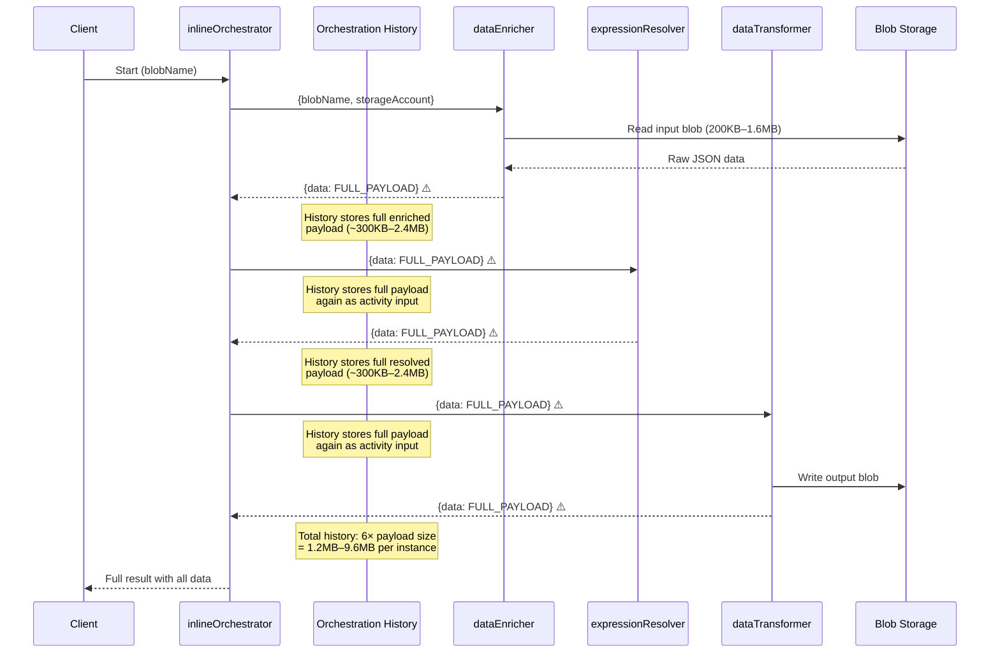
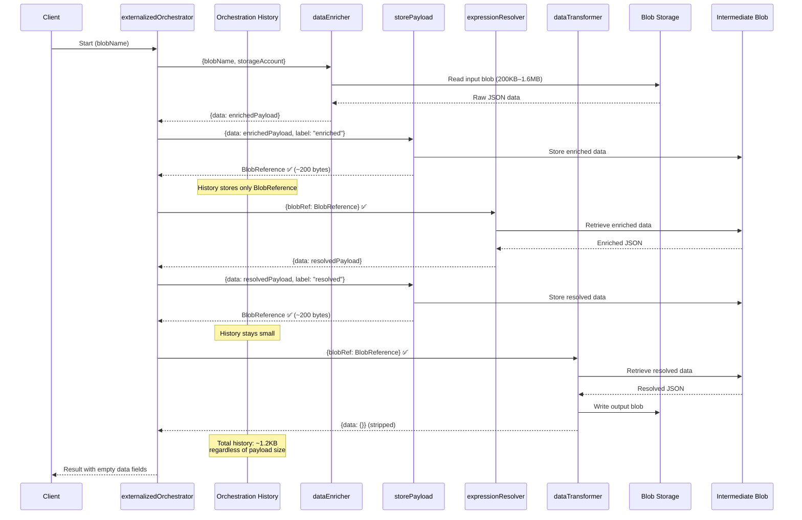
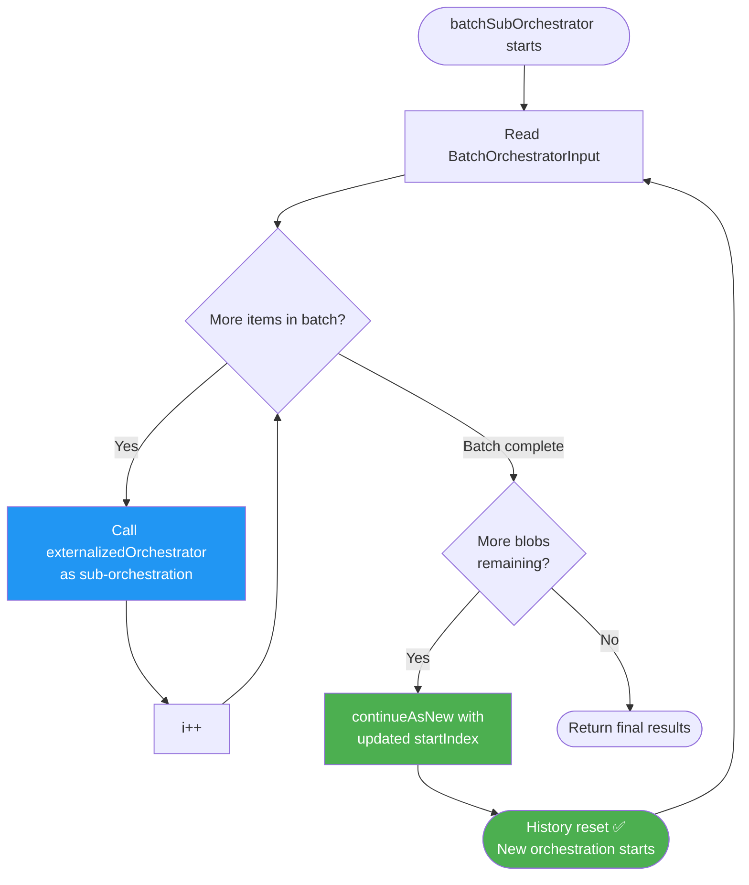

# Durable Function Config Comparison

Compare the performance of two identical Azure Durable Function apps (Node.js 20, v4 programming model) with different host.json and scaling configurations.

## Architecture



## Project Structure

```
├── apps/
│   ├── baseline/          # Function app with default config
│   │   ├── src/index.ts   # Function registrations + HTTP starter
│   │   └── host.json      # Default durableTask settings
│   └── tuned/             # Function app with optimized config
│       ├── src/index.ts   # Same registrations, same shared logic
│       └── host.json      # Tuned durableTask settings
├── packages/
│   └── shared/            # Shared business logic + telemetry
│       └── src/
│           ├── activities/ # 3 sequential blob I/O activities
│           ├── orchestrator/ # Generator-based orchestrator
│           └── telemetry/  # OpenTelemetry instrumentation
├── infra/                 # Terraform (EP3 plans, storage, App Insights, ALT)
├── loadtest/              # JMeter plan + seed data script
├── analytics/             # KQL queries + Azure Monitor Workbook
└── docs/                  # Setup guide, methodology, references
```

## Key Differences: Baseline vs Tuned

| Parameter | Baseline | Tuned |
|-----------|----------|-------|
| `maxConcurrentActivityFunctions` | 40 (default) | 80 |
| `maxConcurrentOrchestratorFunctions` | 40 (default) | 80 |
| `controlQueueBatchSize` | 32 (default) | 64 |
| `controlQueueBufferThreshold` | 256 (default) | 512 |
| `partitionCount` | 4 (default) | 8 |
| `maxQueuePollingInterval` | 00:00:30 (default) | 00:00:05 |
| `FUNCTIONS_WORKER_PROCESS_COUNT` | 1 (default) | 4 |
| `NODE_OPTIONS` | (default) | `--max-old-space-size=10240` |
| EP3 `always_ready` | platform default | 2 |
| EP3 `max_scale_out` | platform default | 10 |
| EP3 `pre_warmed` | platform default | 1 |

## Prerequisites

- Node.js 20 LTS
- Azure Functions Core Tools v4
- Terraform >= 1.5
- Azure CLI
- Azure subscription with permissions for EP3 plans and Azure Load Testing

## Quick Start

```bash
# 1. Install dependencies
npm install

# 2. Build all packages
npx tsc --build

# 3. Deploy infrastructure
cd infra
terraform init
terraform plan -var="subscription_id=<YOUR_SUB_ID>"
terraform apply -var="subscription_id=<YOUR_SUB_ID>"

# 4. Seed test data
cd ../loadtest
./seed-data.sh <baseline_blob_conn_string> <tuned_blob_conn_string>

# 5. Deploy function apps (from each app directory)
cd ../apps/baseline && func azure functionapp publish <baseline-app-name>
cd ../apps/tuned && func azure functionapp publish <tuned-app-name>

# 6. Run load test
az load test create --test-id df-comparison --load-test-resource <alt-name> --test-plan loadtest.jmx
```

## Manual Testing

```bash
# Start an orchestration on baseline
curl -X POST https://<baseline-app>.azurewebsites.net/api/orchestrators/blobProcessingOrchestrator \
  -H "Content-Type: application/json" \
  -d '{"blobName": "sample.json"}'

# Start on tuned
curl -X POST https://<tuned-app>.azurewebsites.net/api/orchestrators/blobProcessingOrchestrator \
  -H "Content-Type: application/json" \
  -d '{"blobName": "sample.json"}'
```

## OOM Payload Comparison: Inline vs Externalized Workflows

A comparison scenario demonstrating how large payloads in Durable Functions can cause memory pressure (OOM) and how externalizing payloads to blob storage mitigates the issue.

Both apps execute the **same three-activity pipeline** — `dataEnricher → expressionResolver → dataTransformer` — but differ in **how intermediate data flows** between activities.

### High-Level Architecture



### Inline Payload Workflow (Anti-Pattern)

The inline orchestrator passes **full JSON payloads** (200KB–1.6MB) as activity inputs and outputs. Every intermediate result is serialized into the Durable Task orchestration history, causing memory growth proportional to `payload_size × 3 × concurrent_orchestrations`.



### Externalized Payload Workflow (Best Practice)

The externalized orchestrator stores intermediate results in blob storage via a `storePayload` activity and passes only **BlobReference objects (~200 bytes)** through orchestration history. Activities retrieve data from blob when needed.



### Batch Processing with `continueAsNew`

The externalized app also supports a `batchSubOrchestrator` that processes multiple blobs in configurable batch sizes and calls `continueAsNew` to reset orchestration history between batches — preventing unbounded history growth.



### Key Differences Summary

| Aspect | Inline Payloads | Externalized Payloads |
|--------|----------------|----------------------|
| **Inter-activity data** | Full JSON in orchestration I/O | BlobReference (~200 bytes) |
| **History size per instance** | 6× payload (1.2–9.6 MB) | ~1.2 KB (constant) |
| **Memory under concurrency** | Grows linearly; OOM risk | Stable; bounded |
| **Additional activities** | 3 (enrich, resolve, transform) | 3 + 2 `storePayload` calls |
| **Extra blob I/O** | None | 2 writes + 2 reads (intermediate) |
| **Batch support** | No | `batchSubOrchestrator` + `continueAsNew` |
| **Orchestrator output** | Full payload in result | Empty `data: {}` fields |

### Configuration Differences (`host.json`)

| Parameter | `inline-payloads` | `externalized-payloads` |
|-----------|-------------------|------------------------|
| `maxConcurrentActivityFunctions` | **40** | **10** |
| `maxConcurrentOrchestratorFunctions` | **40** | **10** |
| `partitionCount` | 4 | 4 |
| `controlQueueBufferThreshold` | 256 | 256 |

The externalized app uses **lower concurrency limits** (10 vs 40) because the blob-externalized pattern adds latency per activity. Lower concurrency avoids overloading blob storage with intermediate payload I/O while keeping memory stable.

### Code Differences

**Orchestrator — inline (anti-pattern):**
```typescript
// Full payload flows through orchestration history
const resolverInput: ResolverInput = {
  data: enricherResult.data,  // ← FULL PAYLOAD (~300KB–2.4MB)
  storageAccount: input.storageAccount,
  containerName: input.inputContainer,
};
const resolverResult = yield context.df.callActivity("expressionResolver", resolverInput);
```

**Orchestrator — externalized (best practice):**
```typescript
// Store payload to blob, pass only reference
const enricherBlobRef = yield context.df.callActivity("storePayload", {
  storageAccount: input.storageAccount,
  containerName: intermediateContainer,
  instanceId, label: "enriched",
  data: enricherResult.data,
});

const resolverInput: ResolverInput = {
  blobRef: enricherBlobRef,  // ← BLOB REFERENCE ONLY (~200 bytes)
  storageAccount: input.storageAccount,
  containerName: intermediateContainer,
};
const resolverResult = yield context.df.callActivity("expressionResolver", resolverInput);
```

**Activity input resolution — both patterns use the same activity code:**
```typescript
// Activities transparently handle both patterns
let data: Record<string, unknown>;
if (input.data) {
  data = input.data;                    // Inline: data provided directly
} else if (input.blobRef) {
  const manager = new BlobPayloadManager(input.storageAccount, input.blobRef.container);
  data = await manager.retrieve(input.blobRef);  // Externalized: fetch from blob
} else {
  // Initial read from source blob
  data = await readFromBlobStorage(input);
}
```

**Function registrations — externalized app has two extra registrations:**
```typescript
// Additional registrations in externalized-payloads/src/index.ts
df.app.orchestration("batchSubOrchestrator", batchSubOrchestratorHandler);

df.app.activity("storePayload", {
  handler: async (input) => {
    const manager = new BlobPayloadManager(storageAccount, containerName);
    return manager.store(data, instanceId, label);  // Returns BlobReference
  },
});
```

### OOM-Specific Structure

```
├── apps/
│   ├── inline-payloads/       # Anti-pattern: large payloads in history
│   └── externalized-payloads/ # Best practice: blob-externalized payloads
├── packages/
│   └── shared-oom/            # Shared activities, orchestrators, telemetry
├── loadtest/
│   └── seed-data-oom.sh       # Generates 200KB–1.6MB test blobs
└── analytics/queries/
    ├── heap_memory_trend.kql
    ├── payload_size_distribution.kql
    └── memory_vs_concurrency.kql
```

### Running the OOM Scenario

```bash
# Seed large test blobs
cd loadtest
chmod +x seed-data-oom.sh
./seed-data-oom.sh

# Start inline orchestration (will show memory growth)
curl -X POST https://<inline-app>/api/orchestrators/inlineOrchestrator \
  -H "Content-Type: application/json" \
  -d '{"blobName": "large-1mb.json"}'

# Start externalized orchestration (stable memory)
curl -X POST https://<externalized-app>/api/orchestrators/externalizedOrchestrator \
  -H "Content-Type: application/json" \
  -d '{"blobName": "large-1mb.json"}'

# Batch mode (externalized only)
curl -X POST https://<externalized-app>/api/orchestrators/externalizedOrchestrator \
  -H "Content-Type: application/json" \
  -d '{"blobNames": ["large-1mb.json", "large-500kb.json", "large-200kb.json"]}'
```

## Documentation

- [Setup Guide](docs/setup-guide.md) — Full deployment walkthrough
- [Comparison Methodology](docs/comparison-methodology.md) — How to interpret results
- [Tuning Reference](docs/tuning-reference.md) — All tuning parameters explained
- [Telemetry Schema](docs/telemetry-schema.md) — Custom spans, metrics, and dimensions
