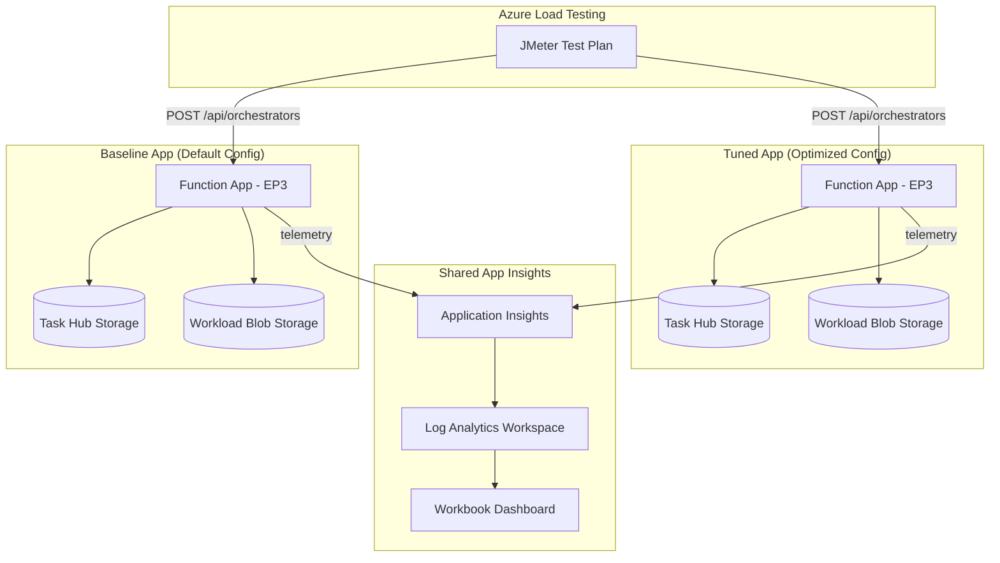

# Durable Function Config Comparison

Compare the performance of two identical Azure Durable Function apps (Node.js 20, v4 programming model) with different host.json and scaling configurations.

## Architecture



## Project Structure

```
├── apps/
│   ├── baseline/          # Function app with default config
│   │   ├── src/index.ts   # Function registrations + HTTP starter
│   │   └── host.json      # Default durableTask settings
│   └── tuned/             # Function app with optimized config
│       ├── src/index.ts   # Same registrations, same shared logic
│       └── host.json      # Tuned durableTask settings
├── packages/
│   └── shared/            # Shared business logic + telemetry
│       └── src/
│           ├── activities/ # 3 sequential blob I/O activities
│           ├── orchestrator/ # Generator-based orchestrator
│           └── telemetry/  # OpenTelemetry instrumentation
├── infra/                 # Terraform (EP3 plans, storage, App Insights, ALT)
├── loadtest/              # JMeter plan + seed data script
├── analytics/             # KQL queries + Azure Monitor Workbook
└── docs/                  # Setup guide, methodology, references
```

## Key Differences: Baseline vs Tuned

| Parameter | Baseline | Tuned |
|-----------|----------|-------|
| `maxConcurrentActivityFunctions` | 40 (default) | 80 |
| `maxConcurrentOrchestratorFunctions` | 40 (default) | 80 |
| `controlQueueBatchSize` | 32 (default) | 64 |
| `controlQueueBufferThreshold` | 256 (default) | 512 |
| `partitionCount` | 4 (default) | 8 |
| `maxQueuePollingInterval` | 00:00:30 (default) | 00:00:05 |
| `FUNCTIONS_WORKER_PROCESS_COUNT` | 1 (default) | 4 |
| `NODE_OPTIONS` | (default) | `--max-old-space-size=10240` |
| EP3 `always_ready` | platform default | 2 |
| EP3 `max_scale_out` | platform default | 10 |
| EP3 `pre_warmed` | platform default | 1 |

## Prerequisites

- Node.js 20 LTS
- Azure Functions Core Tools v4
- Terraform >= 1.5
- Azure CLI
- Azure subscription with permissions for EP3 plans and Azure Load Testing

## Quick Start

```bash
# 1. Install dependencies
npm install

# 2. Build all packages
npx tsc --build

# 3. Deploy infrastructure
cd infra
terraform init
terraform plan -var="subscription_id=<YOUR_SUB_ID>"
terraform apply -var="subscription_id=<YOUR_SUB_ID>"

# 4. Seed test data
cd ../loadtest
./seed-data.sh <baseline_blob_conn_string> <tuned_blob_conn_string>

# 5. Deploy function apps (from each app directory)
cd ../apps/baseline && func azure functionapp publish <baseline-app-name>
cd ../apps/tuned && func azure functionapp publish <tuned-app-name>

# 6. Run load test
az load test create --test-id df-comparison --load-test-resource <alt-name> --test-plan loadtest.jmx
```

## Manual Testing

```bash
# Start an orchestration on baseline
curl -X POST https://<baseline-app>.azurewebsites.net/api/orchestrators/blobProcessingOrchestrator \
  -H "Content-Type: application/json" \
  -d '{"blobName": "sample.json"}'

# Start on tuned
curl -X POST https://<tuned-app>.azurewebsites.net/api/orchestrators/blobProcessingOrchestrator \
  -H "Content-Type: application/json" \
  -d '{"blobName": "sample.json"}'
```

## Documentation

- [Setup Guide](docs/setup-guide.md) — Full deployment walkthrough
- [Comparison Methodology](docs/comparison-methodology.md) — How to interpret results
- [Tuning Reference](docs/tuning-reference.md) — All tuning parameters explained
- [Telemetry Schema](docs/telemetry-schema.md) — Custom spans, metrics, and dimensions
