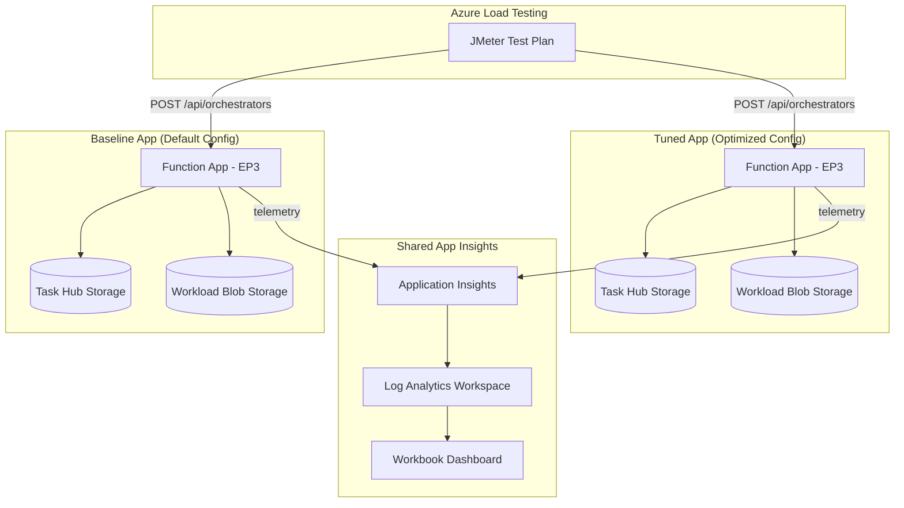
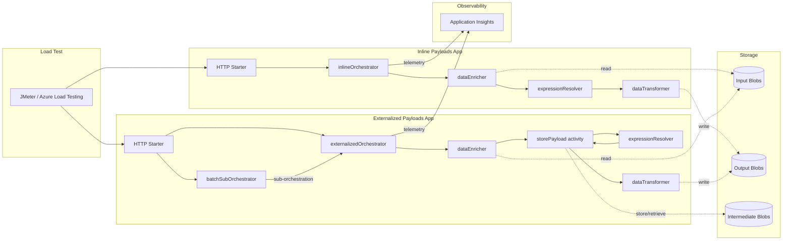
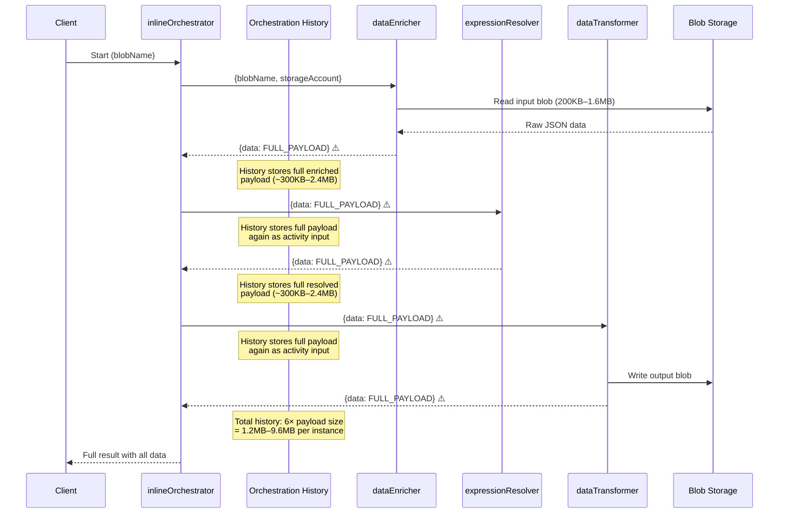
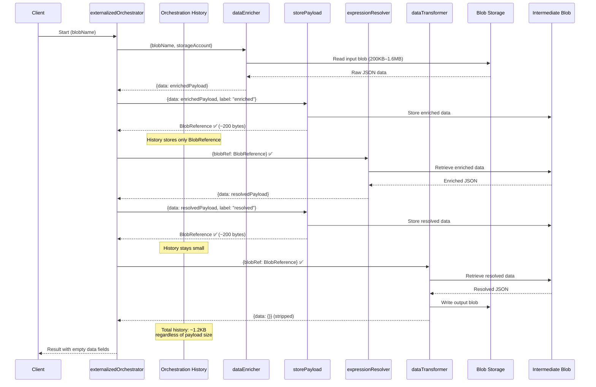
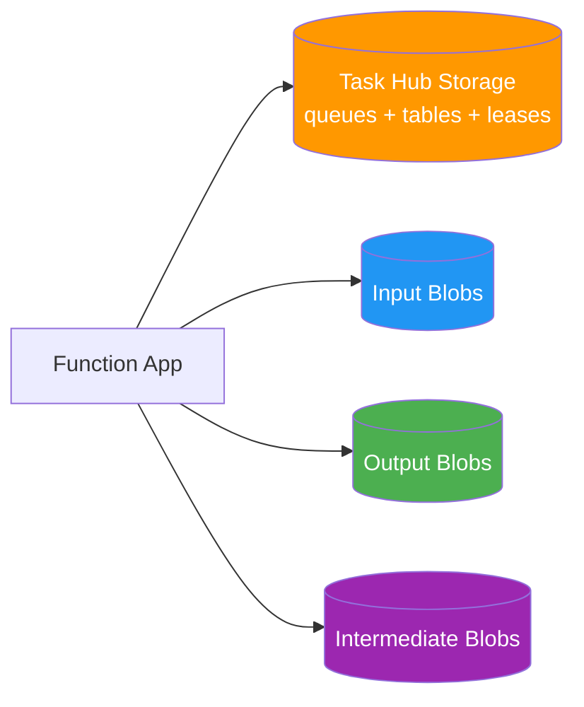
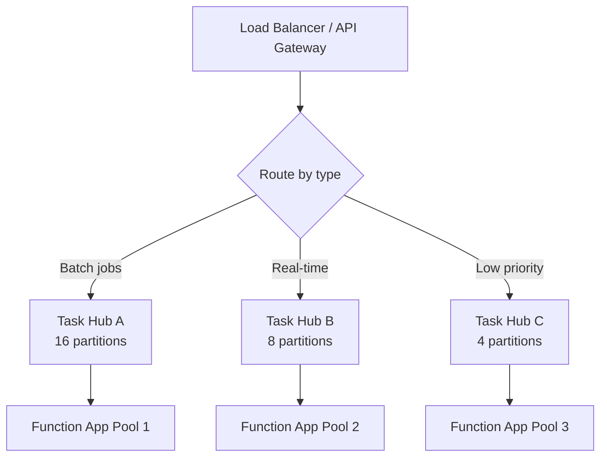

# Durable Function Config Comparison

Compare the performance of two identical Azure Durable Function apps (Node.js 20, v4 programming model) with different host.json and scaling configurations.

## Architecture



## Project Structure

```
├── apps/
│   ├── baseline/          # Function app with default config
│   │   ├── src/index.ts   # Function registrations + HTTP starter
│   │   └── host.json      # Default durableTask settings
│   └── tuned/             # Function app with optimized config
│       ├── src/index.ts   # Same registrations, same shared logic
│       └── host.json      # Tuned durableTask settings
├── packages/
│   └── shared/            # Shared business logic + telemetry
│       └── src/
│           ├── activities/ # 3 sequential blob I/O activities
│           ├── orchestrator/ # Generator-based orchestrator
│           └── telemetry/  # OpenTelemetry instrumentation
├── infra/                 # Terraform (EP3 plans, storage, App Insights, ALT)
├── loadtest/              # JMeter plan + seed data script
├── analytics/             # KQL queries + Azure Monitor Workbook
└── docs/                  # Setup guide, methodology, references
```

## Key Differences: Baseline vs Tuned

| Parameter | Baseline | Tuned |
|-----------|----------|-------|
| `maxConcurrentActivityFunctions` | 40 (default) | 80 |
| `maxConcurrentOrchestratorFunctions` | 40 (default) | 80 |
| `controlQueueBatchSize` | 32 (default) | 64 |
| `controlQueueBufferThreshold` | 256 (default) | 512 |
| `partitionCount` | 4 (default) | 8 |
| `maxQueuePollingInterval` | 00:00:30 (default) | 00:00:05 |
| `FUNCTIONS_WORKER_PROCESS_COUNT` | 1 (default) | 4 |
| `NODE_OPTIONS` | (default) | `--max-old-space-size=10240` |
| EP3 `always_ready` | platform default | 2 |
| EP3 `max_scale_out` | platform default | 10 |
| EP3 `pre_warmed` | platform default | 1 |

## Prerequisites

- Node.js 20 LTS
- Azure Functions Core Tools v4
- Terraform >= 1.5
- Azure CLI
- Azure subscription with permissions for EP3 plans and Azure Load Testing

## Quick Start

```bash
# 1. Install dependencies
npm install

# 2. Build all packages
npx tsc --build

# 3. Deploy infrastructure
cd infra
terraform init
terraform plan -var="subscription_id=<YOUR_SUB_ID>"
terraform apply -var="subscription_id=<YOUR_SUB_ID>"

# 4. Seed test data
cd ../loadtest
./seed-data.sh <baseline_blob_conn_string> <tuned_blob_conn_string>

# 5. Deploy function apps (from each app directory)
cd ../apps/baseline && func azure functionapp publish <baseline-app-name>
cd ../apps/tuned && func azure functionapp publish <tuned-app-name>

# 6. Run load test
az load test create --test-id df-comparison --load-test-resource <alt-name> --test-plan loadtest.jmx
```

## Manual Testing

```bash
# Start an orchestration on baseline
curl -X POST https://<baseline-app>.azurewebsites.net/api/orchestrators/blobProcessingOrchestrator \
  -H "Content-Type: application/json" \
  -d '{"blobName": "sample.json"}'

# Start on tuned
curl -X POST https://<tuned-app>.azurewebsites.net/api/orchestrators/blobProcessingOrchestrator \
  -H "Content-Type: application/json" \
  -d '{"blobName": "sample.json"}'
```

## OOM Payload Comparison: Inline vs Externalized Workflows

A comparison scenario demonstrating how large payloads in Durable Functions can cause memory pressure (OOM) and how externalizing payloads to blob storage mitigates the issue.

Both apps execute the **same three-activity pipeline** — `dataEnricher → expressionResolver → dataTransformer` — but differ in **how intermediate data flows** between activities.

### High-Level Architecture



### Inline Payload Workflow (Anti-Pattern)

The inline orchestrator passes **full JSON payloads** (200KB–1.6MB) as activity inputs and outputs. Every intermediate result is serialized into the Durable Task orchestration history, causing memory growth proportional to `payload_size × 3 × concurrent_orchestrations`.



### Externalized Payload Workflow (Best Practice)

The externalized orchestrator stores intermediate results in blob storage via a `storePayload` activity and passes only **BlobReference objects (~200 bytes)** through orchestration history. Activities retrieve data from blob when needed.



### Batch Processing with `continueAsNew`

The externalized app also supports a `batchSubOrchestrator` that processes multiple blobs in configurable batch sizes and calls `continueAsNew` to reset orchestration history between batches — preventing unbounded history growth.


### Key Differences Summary

| Aspect | Inline Payloads | Externalized Payloads |
|--------|----------------|----------------------|
| **Inter-activity data** | Full JSON in orchestration I/O | BlobReference (~200 bytes) |
| **History size per instance** | 6× payload (1.2–9.6 MB) | ~1.2 KB (constant) |
| **Memory under concurrency** | Grows linearly; OOM risk | Stable; bounded |
| **Additional activities** | 3 (enrich, resolve, transform) | 3 + 2 `storePayload` calls |
| **Extra blob I/O** | None | 2 writes + 2 reads (intermediate) |
| **Batch support** | No | `batchSubOrchestrator` + `continueAsNew` |
| **Orchestrator output** | Full payload in result | Empty `data: {}` fields |

### Configuration Differences (`host.json`)

| Parameter | `inline-payloads` | `externalized-payloads` |
|-----------|-------------------|------------------------|
| `maxConcurrentActivityFunctions` | **40** | **10** |
| `maxConcurrentOrchestratorFunctions` | **40** | **10** |
| `partitionCount` | 4 | 4 |
| `controlQueueBufferThreshold` | 256 | 256 |

The externalized app uses **lower concurrency limits** (10 vs 40) because the blob-externalized pattern adds latency per activity. Lower concurrency avoids overloading blob storage with intermediate payload I/O while keeping memory stable.

### Code Differences

**Orchestrator — inline (anti-pattern):**
```typescript
// Full payload flows through orchestration history
const resolverInput: ResolverInput = {
  data: enricherResult.data,  // ← FULL PAYLOAD (~300KB–2.4MB)
  storageAccount: input.storageAccount,
  containerName: input.inputContainer,
};
const resolverResult = yield context.df.callActivity("expressionResolver", resolverInput);
```

**Orchestrator — externalized (best practice):**
```typescript
// Store payload to blob, pass only reference
const enricherBlobRef = yield context.df.callActivity("storePayload", {
  storageAccount: input.storageAccount,
  containerName: intermediateContainer,
  instanceId, label: "enriched",
  data: enricherResult.data,
});

const resolverInput: ResolverInput = {
  blobRef: enricherBlobRef,  // ← BLOB REFERENCE ONLY (~200 bytes)
  storageAccount: input.storageAccount,
  containerName: intermediateContainer,
};
const resolverResult = yield context.df.callActivity("expressionResolver", resolverInput);
```

**Activity input resolution — both patterns use the same activity code:**
```typescript
// Activities transparently handle both patterns
let data: Record<string, unknown>;
if (input.data) {
  data = input.data;                    // Inline: data provided directly
} else if (input.blobRef) {
  const manager = new BlobPayloadManager(input.storageAccount, input.blobRef.container);
  data = await manager.retrieve(input.blobRef);  // Externalized: fetch from blob
} else {
  // Initial read from source blob
  data = await readFromBlobStorage(input);
}
```

**Function registrations — externalized app has two extra registrations:**
```typescript
// Additional registrations in externalized-payloads/src/index.ts
df.app.orchestration("batchSubOrchestrator", batchSubOrchestratorHandler);

df.app.activity("storePayload", {
  handler: async (input) => {
    const manager = new BlobPayloadManager(storageAccount, containerName);
    return manager.store(data, instanceId, label);  // Returns BlobReference
  },
});
```

### OOM-Specific Structure

```
├── apps/
│   ├── inline-payloads/       # Anti-pattern: large payloads in history
│   └── externalized-payloads/ # Best practice: blob-externalized payloads
├── packages/
│   └── shared-oom/            # Shared activities, orchestrators, telemetry
├── loadtest/
│   └── seed-data-oom.sh       # Generates 200KB–1.6MB test blobs
└── analytics/queries/
    ├── heap_memory_trend.kql
    ├── payload_size_distribution.kql
    └── memory_vs_concurrency.kql
```

### Running the OOM Scenario

```bash
# Seed large test blobs
cd loadtest
chmod +x seed-data-oom.sh
./seed-data-oom.sh

# Start inline orchestration (will show memory growth)
curl -X POST https://<inline-app>/api/orchestrators/inlineOrchestrator \
  -H "Content-Type: application/json" \
  -d '{"blobName": "large-1mb.json"}'

# Start externalized orchestration (stable memory)
curl -X POST https://<externalized-app>/api/orchestrators/externalizedOrchestrator \
  -H "Content-Type: application/json" \
  -d '{"blobName": "large-1mb.json"}'

# Batch mode (externalized only)
curl -X POST https://<externalized-app>/api/orchestrators/externalizedOrchestrator \
  -H "Content-Type: application/json" \
  -d '{"blobNames": ["large-1mb.json", "large-500kb.json", "large-200kb.json"]}'
```

## Future Optimizations

### Storage Isolation for Intermediate Payloads

The current infrastructure uses a single storage account (`externalized_blobs`) for input, output, **and** intermediate-payload containers. At moderate load this is fine, but under high concurrency (500+ simultaneous orchestrations), the intermediate reads/writes (2 per orchestration) compete with input/output I/O on the same account's IOPS budget (~20K ops/sec for Standard LRS).

**Optimization:** Add a dedicated storage account for `intermediate-payloads` to isolate the high-frequency store/retrieve traffic from workload blob operations.

### Partition Count Scaling

`partitionCount` (currently 4) caps the maximum parallelism for orchestration scheduling — each partition is processed by one worker at a time. Under sustained high throughput, this becomes the bottleneck.

**Important:** `partitionCount` cannot be changed after a task hub is created. Scaling requires creating a new task hub with the desired count.

| Concurrency Target | Recommended `partitionCount` |
|-------------------|------------------------------|
| < 200 concurrent orchestrations | 4 (current) |
| 200–1000 | 8 |
| 1000–5000 | 16 |
| 5000+ | Migrate to Durable Task Scheduler (manages partitioning internally) |

### SKU Upgrades

| Current | Upgrade Path | When to Consider |
|---------|-------------|-----------------|
| **P0v3** (1 vCPU, 4GB RAM) | **P1v3** (2 vCPU, 8GB) | Per-instance memory pressure with 4 Node.js workers |
| **P0v3** | **P2v3** (4 vCPU, 16GB) | Need higher per-instance concurrency limits (40+ orchestrations) |
| **P0v3** | **EP1–EP3** (Elastic Premium) | Need auto-scale to zero + burst scaling |
| **Standard LRS storage** | **Premium Block Blob** | Sub-millisecond blob latency needed for intermediates |

**Node.js memory formula:**
```
max_workers = floor(SKU_RAM_GB × 0.8 / per_worker_heap_GB)
per_worker_capacity = maxConcurrentOrchestratorFunctions × avg_history_size_MB
```

### Architectural Scaling Patterns

#### Dedicated Storage Account per Concern



At very high scale, each storage account should be isolated so IOPS limits are independent.

#### Multi-Worker Process Model

```
EP3 (14 GB RAM)
├── Worker 1 (--max-old-space-size=3072)
│   └── 10 concurrent orchestrations
├── Worker 2 (--max-old-space-size=3072)
│   └── 10 concurrent orchestrations
├── Worker 3 (--max-old-space-size=3072)
│   └── 10 concurrent orchestrations
└── Worker 4 (--max-old-space-size=3072)
    └── 10 concurrent orchestrations
    = 40 concurrent orchestrations per instance
```

Set `FUNCTIONS_WORKER_PROCESS_COUNT=4` and `NODE_OPTIONS=--max-old-space-size=3072` to maximize per-instance throughput. Each worker is independent and has its own V8 heap.

#### Durable Task Scheduler (High Throughput)

For workloads exceeding ~2000 concurrent orchestrations, the Azure Storage provider's queue-based dispatch becomes the bottleneck. The [Durable Task Scheduler](https://learn.microsoft.com/en-us/azure/durable-task/scheduler/durable-task-scheduler) is Microsoft's recommended fully managed backend for high-performance scenarios:

```json
{
  "extensions": {
    "durableTask": {
      "hubName": "%TASKHUB_NAME%",
      "storageProvider": {
        "type": "azureManaged",
        "connectionStringName": "DURABLE_TASK_SCHEDULER_CONNECTION_STRING"
      }
    }
  }
}
```

Key benefits:
- **Highest throughput** of all supported storage providers
- **Fully managed** — no storage accounts, partitions, or queue polling to configure
- **Built-in observability** [dashboard](https://learn.microsoft.com/en-us/azure/durable-task/scheduler/durable-task-scheduler-dashboard) for orchestration monitoring
- **Managed identity support** with automatic RBAC (`Durable Task Data Contributor` role)
- **No code changes** required — only `host.json` and connection configuration
- **Docker-based emulator** for local development (`mcr.microsoft.com/dts/dts-emulator:latest`)
- **Partitioning managed internally** — no need to plan or configure `partitionCount`

**Trade-offs:** Requires an Azure Durable Task Scheduler resource (separate billing), but eliminates storage account IOPS management, partition count planning, and queue polling tuning entirely. Supports Flex Consumption, Premium, and App Service plans.

#### Intermediate Payload Lifecycle Management

Intermediate blobs accumulate indefinitely. Add an Azure Storage lifecycle management policy to auto-delete after retention period:

```json
{
  "rules": [{
    "name": "cleanup-intermediates",
    "type": "Lifecycle",
    "definition": {
      "filters": { "blobTypes": ["blockBlob"], "prefixMatch": ["intermediate-payloads/"] },
      "actions": { "baseBlob": { "delete": { "daysAfterModificationGreaterThan": 7 } } }
    }
  }]
}
```

Alternatively, add a cleanup activity at orchestration completion to delete its intermediate blobs immediately.

#### Horizontal Scaling via Multiple Task Hubs

For extreme scale, route orchestrations across multiple task hubs by orchestrator type or tenant:



Each task hub is independent with its own storage accounts, partition counts, and concurrency settings.

### Scaling Decision Matrix

| Symptom | Metric to Watch | Action |
|---------|----------------|--------|
| High queue delay | `orchestration_to_first_activity_latency` > 5s | Increase `partitionCount` (new task hub) or `max_scale_out` |
| Storage throttling | HTTP 429/503 from Azure Storage | Separate storage accounts per concern |
| Worker memory exhaustion | Heap usage > 80% of `max-old-space-size` | Lower `maxConcurrentOrchestratorFunctions` or upgrade SKU |
| All instances at max | Scale-out at ceiling for sustained period | Increase `max_scale_out` or add more workers per instance |
| Activity latency spikes | Blob `SuccessServerLatency` P99 > 200ms | Upgrade to Premium Block Blob storage |
| Replay taking too long | Orchestration replay duration > 5s | Reduce history size (externalize payloads, use `continueAsNew`) |
| Single-instance CPU saturated | CPU > 90% sustained | Upgrade SKU (P1v3 → P2v3) or increase `FUNCTIONS_WORKER_PROCESS_COUNT` |

### Concurrency Tuning Best Practices

From [Azure documentation](https://learn.microsoft.com/en-us/azure/azure-functions/durable/durable-functions-perf-and-scale#concurrency-throttles):

- **Concurrency throttles are per-worker, not system-wide.** Lowering per-worker concurrency can actually *increase* total throughput by triggering the scale controller to add more workers to keep up with queues.
- **Orchestrations unload from memory while awaiting.** Only orchestrations actively processing events count toward `maxConcurrentOrchestratorFunctions`. Millions of instances can be in "Running" state without hitting the throttle.
- **Node.js concurrency is limited by `FUNCTIONS_WORKER_PROCESS_COUNT`.** Each worker process runs its own event loop. Set concurrency limits to match your worker count × per-worker capacity.
- **On Premium plans, enable Runtime Scale Monitoring** after deployment to ensure autoscale responds to Durable Task queue depth:
  ```bash
  az resource update -g <resource_group> -n <app_name>/config/web \
    --set properties.functionsRuntimeScaleMonitoringEnabled=1 \
    --resource-type Microsoft.Web/sites
  ```

### Flex Consumption Plan

For new deployments, consider the [Flex Consumption plan](https://learn.microsoft.com/en-us/azure/azure-functions/flex-consumption-plan) which provides:

- **Scale to zero** with fast cold starts
- **Per-function scaling** — orchestrator and activity functions scale independently
- **VNet integration** included at no extra cost
- **Native support** for both Azure Storage provider and Durable Task Scheduler

The Flex Consumption plan pairs well with the Durable Task Scheduler for the best serverless + high-throughput combination.

## Documentation

- [Setup Guide](docs/setup-guide.md) — Full deployment walkthrough
- [Comparison Methodology](docs/comparison-methodology.md) — How to interpret results
- [Tuning Reference](docs/tuning-reference.md) — All tuning parameters explained
- [Telemetry Schema](docs/telemetry-schema.md) — Custom spans, metrics, and dimensions
